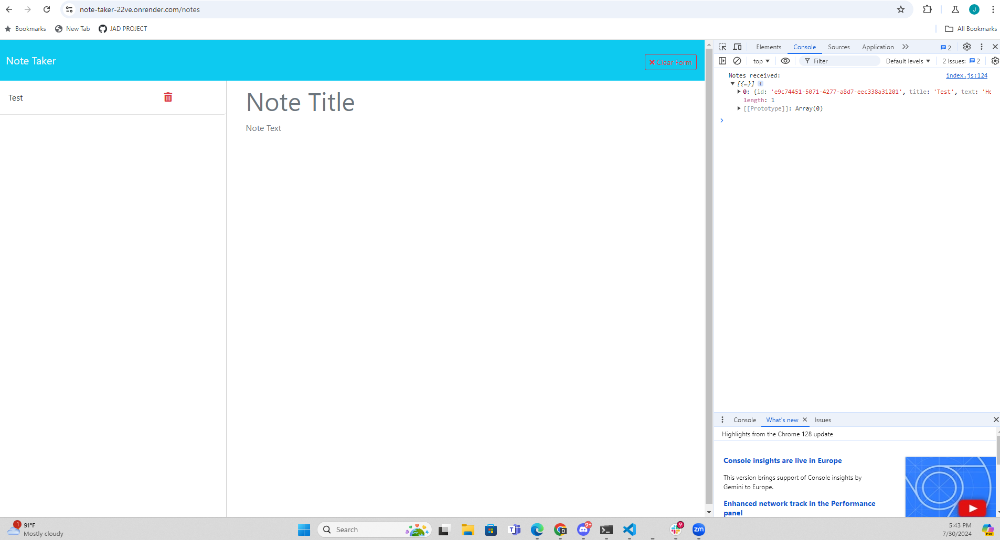
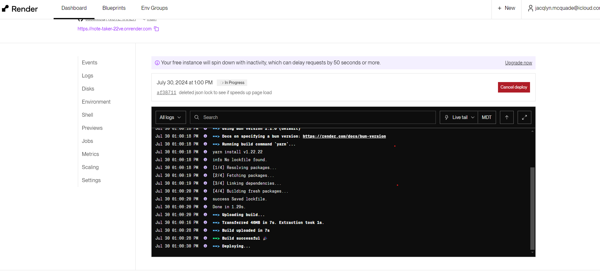

# NOTE-TAKER
Note-Taker can be used to write and save notes. This application will use an Express.js back end and will save and retrieve note data from a JSON file.

## Description
 Note-Taker is an  application provided for  users to house different notes. This  application  also  allows for users to  store  their  data locally using  JSON  key-value pair structuring. There is the ability to add and delete notes as well as retrieve older notes from the list displayed on the left-side panel. 

## Table of Contents
  - [Install](#install)
  - [Usage](#usage)
  - [Credits](#credits)

## Install
To install the Note-taker 
1. clone down repository: git@github.com:JacqMcQ/NOTE-TAKER.git
2. Run npm install

## Usage
Feel free to click on Note Title and insert a title and follow up with adding any Note text to provide additional details. Please note, you can also click the "trashcan icon" to delete a note. 

## Credits
Week 11 Express activities and exercises to assist with concepts used throughout the working/ developing code. AI was also used to support troubleshooting with structuring the delete function as well as debugging for the recall method on the archived notes. 

## Badges
N/A

